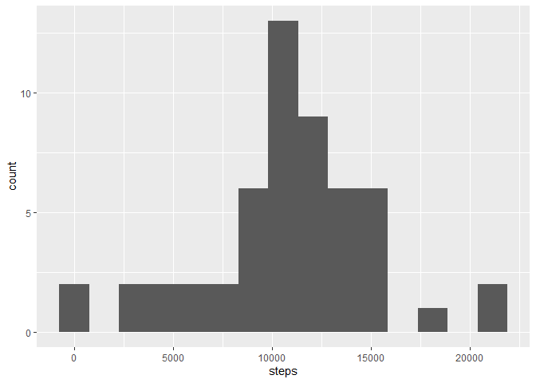
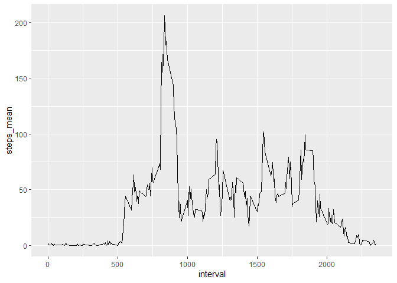
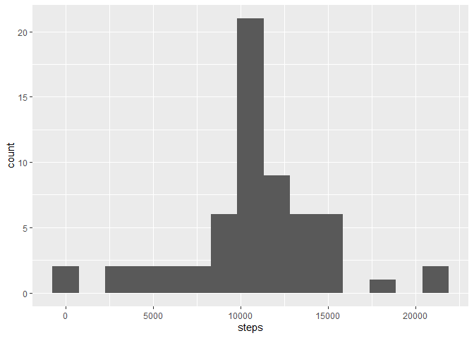
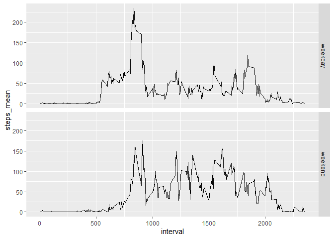

## Loading and preprocessing the data

Let's load the data:  


```r
library(readr)
activity <- read_csv("activity.csv", col_types = cols(steps = col_double()), 
    na = "NA")
```

## What is mean total number of steps taken per day?

Summarize the data by day:  


```r
library(tidyverse)
```

```
## -- Attaching packages --------------------------------------- tidyverse 1.3.1 --
```

```
## v ggplot2 3.3.5     v dplyr   1.0.6
## v tibble  3.1.1     v stringr 1.4.0
## v tidyr   1.2.0     v forcats 0.5.1
## v purrr   0.3.4
```

```
## -- Conflicts ------------------------------------------ tidyverse_conflicts() --
## x dplyr::filter() masks stats::filter()
## x dplyr::lag()    masks stats::lag()
```

```r
activity_day <- activity %>%
  group_by(date) %>%
  summarise(steps = sum(steps))
```

and plot the histogram of daily steps:  


```r
g <- ggplot(activity_day, aes(x = steps)) 
g <- g + geom_histogram(bins = 15)
plot(g)
```

```
## Warning: Removed 8 rows containing non-finite values (stat_bin).
```

<!-- -->

There are 1.0766189\times 10^{4} mean and 1.0765\times 10^{4} median steps per day.  

## What is the average daily activity pattern?

Summarize the data by interval:  


```r
library(tidyverse)

activity_time <- activity %>%
  group_by(interval) %>%
  summarise(steps_mean = mean(steps, na.rm = TRUE))
```

and plot it:  


```r
g <- ggplot(activity_time, aes(x = interval, y = steps_mean)) 
g <- g + geom_line()
plot(g)
```

<!-- -->
  
  
The time interval 835 contains the maximum steps.  

There are 2304 "NA" in the data set.  

## Imputing missing values

Let's replace the NA's with the mean of the considered time interval:


```r
activity_filled <- activity %>%
  group_by(interval) %>%
  mutate(steps_mean_interval = mean(steps, na.rm = TRUE)) %>%
  mutate(steps = coalesce(steps,steps_mean_interval))
```

Again, let's summarize the data by day:  


```r
activity_filled_day <- activity_filled %>%
  group_by(date) %>%
  summarise(steps = sum(steps))
```

and plot the histogram of daily steps:  


```r
g <- ggplot(activity_filled_day, aes(x = steps)) 
g <- g + geom_histogram(bins = 15)
plot(g)
```

<!-- -->

There are 1.0766189\times 10^{4} mean and 1.0766189\times 10^{4} median steps per day.  

Since the NA's were replaced with the median values, neither the histogram nor the median and mean changed.  

## Are there differences in activity patterns between weekdays and weekends?


```r
activity_weekday <- activity %>%
  mutate(week = factor(ifelse(weekdays(activity$date) %in% c("Samstag", "Sonntag"), "weekend", "weekday"))) %>%
  group_by(week, interval) %>%
  summarise(steps_mean = mean(steps, na.rm = TRUE))
```

```
## `summarise()` has grouped output by 'week'. You can override using the `.groups` argument.
```


```r
g <- ggplot(activity_weekday, aes(x = interval, y = steps_mean))
g <- g + geom_line() + facet_grid(rows = vars(week))
plot(g)
```

<!-- -->
